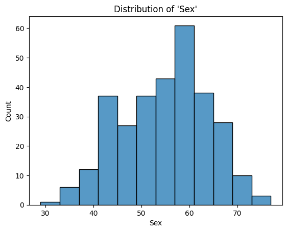
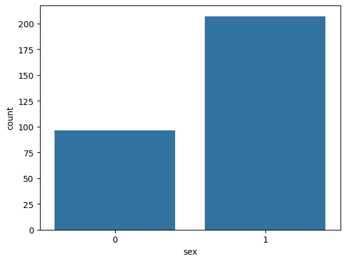
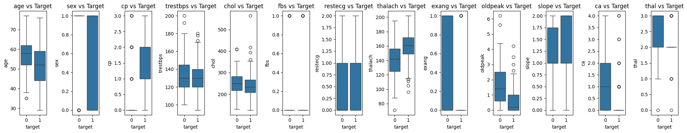
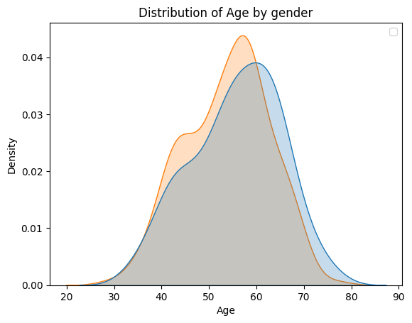
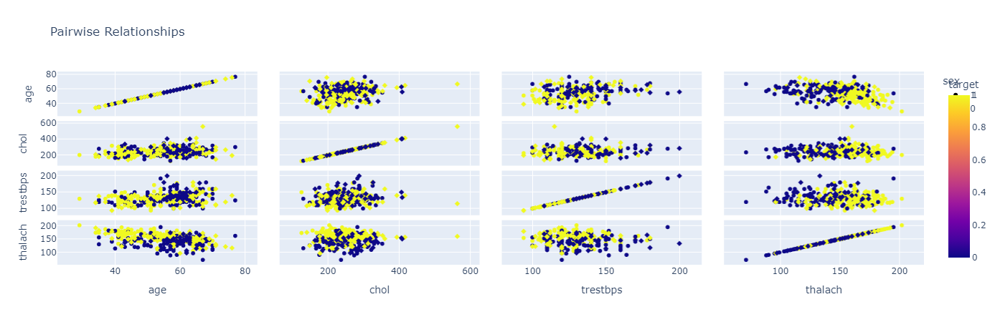
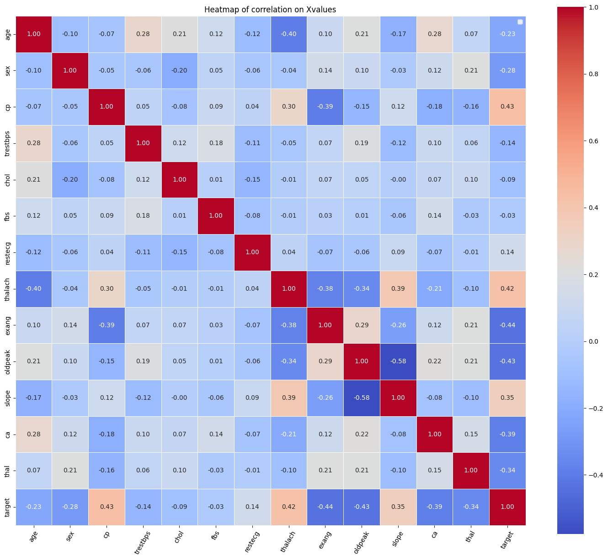

# Heart Disease Prediction Project

Project Overview

This project aims to predict heart disease using a machine learning approach. The dataset used for this analysis is the "Heart Disease UCI" dataset, which provides various information about patients, such as age, gender, blood pressure, cholesterol levels, and more. The project involves exploring the dataset, visualizing important features, training several machine learning models, and evaluating their performance.

Dataset

The dataset used for this project is available on Kaggle:

- [Heart Disease UCI Dataset](https://www.kaggle.com/datasets/ronitf/heart-disease-uci)

Project Structure

1. Data Loading and Exploration:
   - Import the dataset and display basic information.
   - Check for missing values, duplicates, and basic statistics.

2. Data Visualization:
   - Distribution of key features such as age and sex.
   - Boxplots showing feature distributions against the target variable.
   - KDE plots and scatter matrix for deeper insights.

3. Feature Engineering:
   - Create new features or modify existing ones if necessary.

4. Model Training and Evaluation:
   - Logistic Regression
   - XGBoost Classifier
   - Random Forest Classifier
   - Evaluate models using accuracy and other metrics.

5. Prediction:
   - Use the trained models to make predictions on new data.

6. Saving the Model:
   - Save the Random Forest model to a file for future use.

Visualizations

Here are some key visualizations from the project:

1. Age Distribution


*Description*: This histogram shows the distribution of ages in the dataset.

### 2. Gender Distribution


*Description*: This count plot illustrates the number of male and female patients.

### 3. Feature vs Target


*Description*: Boxplots of various features against the target variable to understand their distribution.

### 4. Age Distribution by Sex


*Description*: KDE plot showing the age distribution, differentiated by gender.

### 5. Pairwise Relationships


*Description*: Scatter matrix showing pairwise relationships between features colored by the target variable.

### 6. Heatmap of Correlations


*Description*: Heatmap showing correlations between features.

Screenshots
Here are a few screenshots of the web application in action:

## Screenshots

Here are a few screenshots of the web application in action:

- **Screenshot 1**: how the Home page looks.
  

- **Screenshot 2**: where the user can input characteristics of Heart Disease.
  

- **Screenshot 3**: Prediction result showing whether the disease is Heart Disease or not.
  
  
## How to Use

1. **Clone the Repository**:
   ```bash
   git clone https://github.com/yourusername/heart-disease-prediction.git
   ```

2. **Install Dependencies**:
   ```bash
   pip install numpy pandas matplotlib seaborn plotly scikit-learn xgboost
   ```

3. **Run the Notebook**:
   Open the Jupyter notebook and run the cells to reproduce the analysis.

4. **Load the Model**:
   ```python
   import pickle
   model = pickle.load(open('model.pkl', 'rb'))
   ```

5. **Make Predictions**:
   Use the loaded model to make predictions on new data.

## License

This project is licensed under the MIT License - see the [LICENSE](LICENSE) file for details.

## Acknowledgments

- The dataset is provided by the UCI Machine Learning Repository and is available on Kaggle.
- Special thanks to the contributors of the libraries used in this project.

```

### Additional Notes:
- **Images**: Save the visualizations as images (e.g., `age_distribution.png`) in an `images` directory within your project folder. Replace the placeholder paths with the actual paths to your saved images.
- **GitHub Repository**: Replace `yourusername` with your GitHub username or the relevant repository URL.
- **Dependencies**: Ensure that all necessary Python libraries are listed and correctly installed.
- **License**: Adjust the license section if you have a different license for your project.

You can add, update, or remove sections based on the specifics of your project and any additional details you want to provide.
